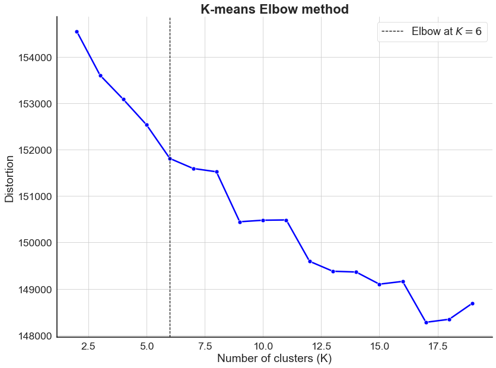

# molcluster
> Cluster molecules using kmeans, butina or HDBSCAN.


## How to use

You can use anyfunction to generate descriptors for the molecules in the dataset. For instance, we could use morgan fingerprints from RDkit to generate a vector of 1024 bits for each molecule. 

```python
from molcluster.unsupervised_learning.clustering import KMeansClustering, HDBSCANClustering, ButinaClustering
from molcluster.unsupervised_learning.transform import UMAPTransform, PCATransform
```

```python
data = pd.read_csv('data/data.csv').sample(n=2000)
```

```python
data.shape
```


    (2000, 2)


```python
X = np.array([Chem.AllChem.GetMorganFingerprintAsBitVect(x, radius=1024) for x in list(map(Chem.MolFromSmiles, data.SMILES.values))])
```

```python
X.shape
```


    (2000, 2048)


# Dimensionality reduction

## Principal component analysis (PCA)

```python
pca_reducer = PCATransform(X)
```

```python
pca_embeddings = pca_reducer.reduce(n_components=2)
pca_embeddings[0:5]
```


    array([[-0.1494844 ,  1.17992167],
           [ 0.64227756,  0.15215376],
           [-0.60019239,  0.27229465],
           [-0.59779871, -1.0310778 ],
           [-0.91177229, -1.12422635]])


## UMAP

```python
umap_reducer = UMAPTransform(X)
```

```python
umap_embeddings = umap_reducer.reduce(n_neighbors=10, min_dist=0.25, metric='euclidean')
umap_embeddings[0:5]
```


    array([[0.6595113, 1.0772064],
           [1.9561116, 1.2333615],
           [0.7492592, 2.2196445],
           [3.0109699, 3.8354385],
           [2.7176857, 4.497201 ]], dtype=float32)


## Kmeans clustering with 10 clusters

```python
clustering_kmeans = KMeansClustering(X)
labels = clustering_kmeans.cluster(n_clusters=10)
labels[0:5]
```


    array([9, 6, 4, 4, 4], dtype=int32)


## Using the elbow method to select the optimal number of clusters

```python
clustering_kmeans.elbow_method(n_clusters=np.arange(2, 20))
```


    

    


## Butina clustering with similarity threshold > 0.7

```python
mol_list = data.SMILES.values
```

```python
clustering_butina = ButinaClustering(mol_list)
labels = clustering_butina.cluster(sim_cutoff=0.7)
labels[0:5]
```


    [1792, 1791, 1790, 78, 1789]


## HDBSCAN clustering

```python
clustering_hdbscan = HDBSCANClustering(X)
labels = clustering_hdbscan.cluster(min_cluster_size=5,min_samples=1,metric='euclidean')
```

```python
np.unique(labels)
```


    array([-1,  0,  1])


