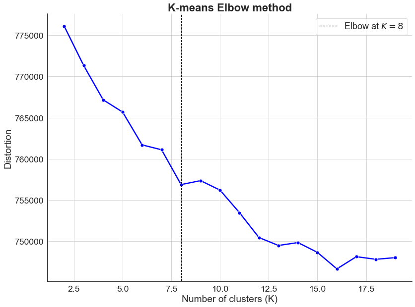

# molcluster
> Cluster molecules using kmeans, butina or HDBSCAN.


## How to use

You can use anyfunction to generate descriptors for the molecules in the dataset. For instance, we could use morgan fingerprints from RDkit to generate a vector of 1024 bits for each molecule. 

```
from molcluster.unsupervised_learning import KMeansClustering, HDBSCANClustering, ButinaClustering
```

```
data = pd.read_csv('data/data.csv').sample(n=10000)
```

```
data.shape
```


    (10000, 2)


```
X = np.array([Chem.AllChem.GetMorganFingerprintAsBitVect(x, radius=1024) for x in list(map(Chem.MolFromSmiles, data.SMILES.values))])
```

```
X.shape
```


    (10000, 2048)


## Kmeans clustering with 10 clusters

```
clustering_kmeans = KMeansClustering(X)
labels = clustering_kmeans.cluster(n_clusters=10)
labels[0:5]
```


    array([5, 6, 6, 1, 5], dtype=int32)


## Using the elbow method to select the optimal number of clusters

```
clustering_kmeans.elbow_method(n_clusters=np.arange(2, 20))
```


    

    


## Butina clustering with similarity threshold > 0.7

```
mol_list = data.SMILES.values
```

```
clustering_butina = ButinaClustering(mol_list)
labels = clustering_butina.cluster(sim_cutoff=0.7)
labels[0:5]
```


    [134, 7149, 617, 77, 7148]


## HDBSCAN clustering

```
clustering_hdbscan = HDBSCANClustering(X)
labels = clustering_hdbscan.cluster(min_cluster_size=5,min_samples=1,metric='euclidean')
```

```
np.unique(labels)
```


    array([-1,  0,  1])


